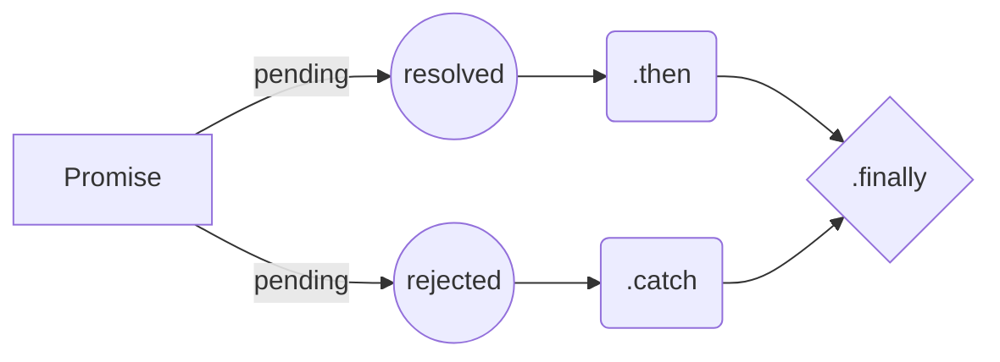
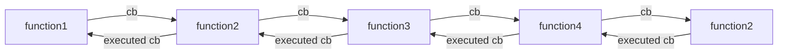

## Promises in Javascript

----

**Promises** were introduced to the Javascript with ES2015. We're going to take an in-depth look at what promises are, why they were required & how to use promises to model various kinds of asynchronous operations.

----

**Table of Contents**
- What's a promise ?
- Why promises were required ?
- How to create a promise ?
- How to catch errors in a promise ?
- How to handle default situations ? 
- How to reject a promise ?
- How to resolve a promise ?
- How to resolve one of the many promises ?
- How to wait & resolve all promises ?
- Async/Await (New way of dealing with promises)

----

#### What's a promise?
Promise in Javascript are exactly similar to the real world promise.

Let us take simple scenario -

"Chandler asks Joey to get rid of the entertainment center. Joey **promises** Chandler that he would get rid of it but needs some time. It's hard for Joey to get rid of his fine Italian craftsmanship. Now, Chandler has to wait for Joey to make a decision. If Joey decides to **keep** the entertainment center **(reject the promise)**, Chandler has to get rid of it by some other way (throw it away :D ). But, Joey finally **agrees (keeeps the promise)** & they print an ad in the newspaper to sell the entertainment center"



----

#### Why promises were required ?

**Promises** were introduced to counter the effect of *callback* hell. Further, passing *function* as arguments reduces code readability & increases code complexity. All this can be countered by using the *Promises*.



----

#### How to create a promise ?

```js
const promise = new Promise((resolve, reject) => {
  const isResolved = asyncTask(); // Perform async or code-blocking task
  if (isResolved) { 
    resolve(); // Resolve promise if everything is fine.
  } else {
    reject(); // Otherwise, reject the promise
  }
})
```

**Using fetch API**

**fetch API** can be used to perform AJAX calls. This returns a promise which could be used to get the result. 

```js
// #region Setup
const API_URL = "https://api.github.com";

const $output = document.getElementById("output");
const $spinner = document.getElementById("spinner");

// #endregion
fetch(API_URL + "/users")
  .then(response => response.json())
  .then(users => {
    const usersHTML = users
      .map(user => {
        return `<li>${user.name}</li>`;
      })
      .join("\n");
    $output.innerHTML = usersHTML;
    $spinner.remove();
  });

```
----

#### How to catch errors in a promise ?

In promise chain, **.then** function takes 2 arguments 
- success function (executed when promise is resolved)
- error function (executed when promise is rejected)

```js
fetch("URL")
    .then(      
      () => {}, // isResolved      
      () => {}// isRejected
    )     
```

Now, we can create a common block where we can catch all the errors as follows 

```js
fetch("URL")
    .then(() => {})
    .then(undefined, () => {});
```

This practice is so common that this block can be replaced as .catch block

```js
fetch("URL")
    .then(() => {})
    .catch(() => {});
```

*NOTE : Fetch will always enter the resolve block if promise is fulfilled. That is, even if api response is not 200.*

```js
fetch(API_URL + "/users")
  .then(response =>
    response.ok ? response.json() : Error("Unsuccessfull response")
  )
  .then(users => {
    const usersHTML = users
      .map(user => {
        return `<li>${user.login}</li>`;
      })
      .join("\n");
    $output.innerHTML = usersHTML;
    $spinner.remove();
  })
  .catch(err => {
    console.log(err);
    $output.innerText = ":(";
    $spinner.remove();
  });

```

----

#### How to handle default situations ?

```js
fetch(API_URL + "/users")
  .then(response =>
    response.ok ? response.json() : Error("Unsuccessfull response")
  )
  .then(users => {
    const usersHTML = users
      .map(user => {
        return `<li>${user.login}</li>`;
      })
      .join("\n");
    $output.innerHTML = usersHTML;
  })
  .catch(err => {
    console.log(err);
    $output.innerText = ":(";
  })
  .finally(() => $spinner.remove());

```
----
#### How to reject a promise ?

Using **Promise.reject** we can reject a promise. 

In our example instead of simply returning an error when response is not ok, we can actually reject the Promise as following 

```js
Promise.reject(new Error("Unsuccessfull response"))
```

---- 
#### How to resolve a promise ?

We can use **Promise.resolve** to convert any non-standard promise into native promise

```js
Promise.resolve($.ajax(`${API_URL}/users`))
  .then(users => {
    $output.innerHTML = users.map(user => `<li>${user.login}</li>`);
  })
  .catch(err => {
    $output.innerText = ":(";
  })
  .finally(() => {
    $spinner.remove();
  });
```
----

#### How to resolve one of the many promises ?

```js
function resolveAfter(ms, value) {
    return new Promise(resolve => {
        setTimeout(() => {
            resolve(value);
        }, ms);
    });
}

const promiseA = resolveAfter(1000, 'a');
const promiseB = resolveAfter(2000, 'b');

const promise = Promise.race([promiseA, promiseB]).finally(() => {});

promise.then((v) => console.log(v));
```

----

#### How to wait & resolve all promises ?

```js
const queryAPI = endpoint => {
  return fetch(`${API_URL}/${endpoint}`).then(response =>
    response.ok
      ? response.json()
      : Promise.reject(new Error("Unsuccessfull response"))
  );
};

Promise.all([queryAPI("users"), queryAPI("repositories")])
  .then(([users, repos]) => {
    $output.innerText = `${users.length} users, ${repos.length} repos`;
  })
  .catch(err => {
    $output.innerText = ":(";
  })
  .finally(() => {
    $spinner.remove();
  });
```

----

#### Async/Await (New way of dealing with promises)

```js
async function queryAPI(endpoint) {
  const response = await fetch(`${API_URL}/${endpoint}`);
  if (response.ok) {
    return response.json();
  }
  throw Error("Unsuccessfull response");
}

// #endregion
async function main() {
  try {
    const users = await queryAPI("users");
    const repositories = await queryAPI("repositories");
    $output.innerText = `${users.length} users, ${repositories.length} repos`;
  } catch (err) {
    console.log(err);
    $output.innerText = ":(";
  }
  $spinner.remove();
}

main();
```
